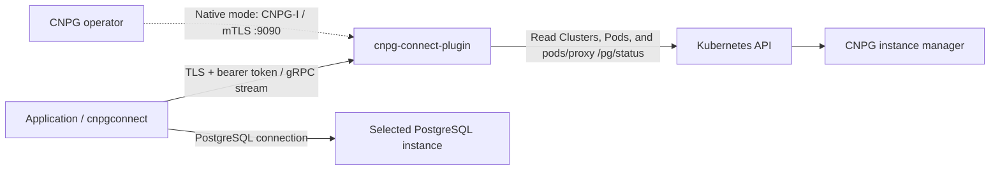

# cnpg-connect-plugin

PostgreSQL topology discovery for applications using **CloudNativePG 1.30.0**. Discover the primary and distinguish synchronous, quorum, potential synchronous, and asynchronous standbys through a **gRPC streaming API**.

Run one plugin Deployment alongside the CNPG operator. Applications connect to its discovery API, then connect directly to the selected PostgreSQL instance. They need no Kubernetes credentials. The companion `github.com/nakiner/cnpgconnect` Go library, available in a separate source checkout, manages discovery reconnects and role-aware connections for pgx, `database/sql`, Bun, and other SQL-based libraries.

The plugin observes role changes in every direction: synchronous → asynchronous, synchronous → primary, primary → standby, and subsequent changes. CNPG remains responsible for promotion, fencing, and replication configuration. “Read-only discovery” refers to the plugin's Kubernetes access, not to the database roles it can discover.

This is an initial implementation targeting CNPG-I 0.5.0. Local integration tests passed against a real three-instance CNPG cluster, including switchover, standby replacement, and automatic failover while discovery was stopped in annotation mode. See the [validation record](docs/validation.md) for versions, coverage, and deployment checks still required in your environment. Release automation publishes the container image and Helm chart to GitHub Container Registry (GHCR). The installation below uses version `0.0.1`; its artifacts become available after the [release workflow](docs/releasing.md) succeeds for the existing `v0.0.1` source tag.

## Contents

- [Architecture and observation modes](#architecture-and-observation-modes)
- [Prerequisites](#prerequisites)
- [Install in Kubernetes](#install-in-kubernetes)
- [Verify discovery](#verify-discovery)
- [Expose discovery and PostgreSQL to external applications](#expose-discovery-and-postgresql-to-external-applications)
- [Connect applications](#connect-applications)
- [Certificate options](#certificate-options)
- [Configuration reference](#configuration-reference)
- [Operations](#operations)
- [Troubleshooting](#troubleshooting)
- [Local development](#local-development)
- [Publishing releases](docs/releasing.md)
- [Uninstall](#uninstall)

## Architecture and observation modes



The chart creates a Deployment, ServiceAccount, RBAC, two Services, and optional cert-manager resources. No additional backend, discovery CRD, database sidecar, or SQL proxy is needed.

| Listener | Service port | Authentication | Consumer |
| --- | --- | --- | --- |
| CNPG-I `:9090` | `9090` | Mutual TLS | CNPG operator |
| Discovery `:8080` | `443` by default | Server TLS + bearer token | Applications |
| Health `:8081` | No Service | HTTP, unauthenticated; no Service | Kubernetes probes |

Both gRPC listeners require TLS 1.3. Discovery and PostgreSQL have separate credentials, TLS configuration, and network endpoints.

Choose how each Cluster opts in:

| Mode | Cluster configuration | Effect on CNPG availability |
| --- | --- | --- |
| **Annotation observation — recommended** | `connect.cnpg.io/enabled: "true"` annotation; no `connect.cnpg.io` entry in `spec.plugins` | Discovery is outside that Cluster's native plugin reconciliation path |
| Native CNPG-I integration | Enabled `connect.cnpg.io` entry in `spec.plugins` | CNPG calls the plugin during reconciliation; plugin failure can delay reconciliation and failover |

In CNPG 1.30.0, native plugin loading and Pre-hook failures can abort reconciliation before failover processing. See [mode selection and upstream evidence](docs/deployment.md#observation-modes-and-cnpg-availability). Both modes provide the same topology API and observe the same role transitions. The installation below uses annotation mode.

A native entry takes precedence over annotations, including `enabled: false`, which disables observation. To change from native to annotation mode, remove only this plugin's native entry and preserve any other plugins.

## Prerequisites

- A Kubernetes cluster with **CloudNativePG 1.30.0** running, and permission to install resources in its operator namespace and the database namespace. The chart declares Kubernetes `>=1.30`; also follow CNPG's supported Kubernetes versions.
- `kubectl` configured for the intended cluster and Helm **3.8+**, with built-in OCI support. Installation does not require Docker, Go, or a source checkout; those are needed only for development.
- Access to `ghcr.io` from your Helm client and Kubernetes nodes. Private packages require separate Helm login and node image-pull credentials, described below.
- cert-manager, or the three existing TLS Secrets described under [certificate options](#certificate-options).
- For the verification commands: `curl`, `openssl`, `grpcurl`, and `jq`.
- Network access from the plugin to the Kubernetes API, and API-server proxy access to the CNPG instance managers. Applications must reach discovery and their chosen PostgreSQL endpoints.

The examples use these names consistently; replace them for your installation:

| Setting | Example |
| --- | --- |
| Helm release | `connect` |
| Operator / plugin namespace | `cnpg-system` |
| Chart `fullnameOverride` | `cnpg-connect` |
| Watched database namespace | `databases` |
| CNPG Cluster | `app-db` |
| Release version | `0.0.1` (source tag `v0.0.1`) |
| Container image | `ghcr.io/nakiner/cnpg-connect-plugin:0.0.1` |
| OCI chart | `oci://ghcr.io/nakiner/charts/cnpg-connect-plugin` |

Install into the operator namespace so native CNPG-I registration can discover the Service and its TLS Secrets. Use **one release per operator installation**. All releases advertise the same plugin name, `connect.cnpg.io`; multiple releases visible to one operator can replace each other's registration. Use `replicaCount` to replicate one release.

<details>
<summary>Optional: install dependencies on a new development cluster</summary>

Skip this if CNPG and cert-manager are already managed in your environment. These are separate cluster-wide components, not dependencies installed by this chart.

Install the [official CNPG 1.30.0 manifest](https://raw.githubusercontent.com/cloudnative-pg/cloudnative-pg/release-1.30/releases/cnpg-1.30.0.yaml):

```sh
kubectl apply --server-side -f \
  https://raw.githubusercontent.com/cloudnative-pg/cloudnative-pg/release-1.30/releases/cnpg-1.30.0.yaml
kubectl -n cnpg-system rollout status deployment/cnpg-controller-manager --timeout=180s
```

Install cert-manager once per cluster, following its [Helm installation guide](https://cert-manager.io/docs/installation/helm/). The following pins the version used for local validation:

```sh
helm install cert-manager oci://quay.io/jetstack/charts/cert-manager \
  --version v1.21.2 \
  --namespace cert-manager --create-namespace \
  --set crds.enabled=true \
  --wait --timeout 5m
```

A new PostgreSQL Cluster also needs a suitable StorageClass and enough capacity for its instances. Configure these before applying the example Cluster.

</details>

## Install in Kubernetes

Run these commands from a directory where you keep deployment configuration. No source checkout or `helm repo add` is needed. Keep `work/` and its credentials out of version control; this repository already ignores that directory.

### 1. Check the release and registry access

The image and chart are separate GHCR packages. After the maintainer publishes `v0.0.1` and makes **both packages public**, installation is anonymous. A Git tag alone does not publish either artifact; see [publishing v0.0.1](docs/releasing.md#publish-v001). Check the [release workflow](https://github.com/nakiner/cnpg-connect-plugin/actions/workflows/release.yaml) and [GHCR packages](https://github.com/nakiner?tab=packages) for publication status.

```sh
helm show chart oci://ghcr.io/nakiner/charts/cnpg-connect-plugin --version 0.0.1
helm show values oci://ghcr.io/nakiner/charts/cnpg-connect-plugin --version 0.0.1
```

The chart selects `ghcr.io/nakiner/cnpg-connect-plugin:0.0.1` by default. Published images support `linux/amd64` and `linux/arm64`. Image tags and chart versions omit the Git tag's leading `v`. Pin `--version` during installation and upgrades. See [Helm's OCI documentation](https://helm.sh/docs/v3/topics/registries/) for registry commands.

<details>
<summary>Private GHCR packages: authenticate Helm and Kubernetes separately</summary>

Use a GitHub personal access token **(classic)** with `read:packages` and access to these packages. Authorize it for organization SSO if required. Public packages do not need this token. See [GitHub's GHCR authentication instructions](https://docs.github.com/en/packages/working-with-a-github-packages-registry/working-with-the-container-registry#authenticating-with-a-personal-access-token-classic).

Authenticate Helm interactively; enter the token at the password prompt:

```sh
helm registry login ghcr.io --username YOUR_GITHUB_USERNAME
```

This authorizes chart downloads on your workstation. Kubernetes separately needs a `kubernetes.io/dockerconfigjson` Secret in `cnpg-system` containing GHCR read credentials. If you already have a dedicated Docker-format authentication file from your secret manager, create the Secret without putting the token on the command line:

```sh
kubectl -n cnpg-system create secret generic ghcr-pull \
  --type=kubernetes.io/dockerconfigjson \
  --from-file=.dockerconfigjson=/secure/path/ghcr-config.json
```

The file must contain actual registry authentication, not a workstation-only credential-helper reference. Add this to `work/values.yaml` in step 3:

```yaml
imagePullSecrets:
  - name: ghcr-pull
```

Helm login does not create this Kubernetes Secret. Making only the chart public still leaves Pods unable to pull a private image.

</details>

### 2. Prepare the namespace and discovery token

Confirm the current context and create the database namespace if it does not exist:

```sh
kubectl config current-context
kubectl get namespace cnpg-system
kubectl create namespace databases --dry-run=client -o yaml | kubectl apply -f -
mkdir -p work
```

`watchNamespace: databases` creates a Role and RoleBinding **in `databases`**, referring to the ServiceAccount in `cnpg-system`. Helm's `--create-namespace` only creates the release namespace; it does not create the watched namespace.

Generate a token once for a new installation, then store it in your secret-management system. The plugin requires at least 32 non-whitespace characters. This command creates a 64-character random token without printing it:

```sh
(umask 077; openssl rand -hex 32 > work/discovery-token)
kubectl -n cnpg-system create secret generic cnpg-connect-auth \
  --from-file=token=work/discovery-token
```

For an existing installation, reuse its token and Secret. Re-running token generation is a credential rotation, not a routine upgrade. The token authorizes access to **all enrolled Clusters in this deployment's watch scope**; there is no per-application or per-Cluster authorization.

### 3. Write Helm values

Create `work/values.yaml`:

```yaml
fullnameOverride: cnpg-connect
replicaCount: 1
watchNamespace: databases
application:
  auth:
    existingSecret: cnpg-connect-auth
    key: token
```

The defaults generate a private CA and three leaf certificates with cert-manager, and expose discovery only inside Kubernetes. No image override is needed: the packaged chart selects its matching GHCR image. For private packages, use the `imagePullSecrets` configuration above. Certificate alternatives and external access are covered below.

### 4. Install and wait for readiness

```sh
helm template connect oci://ghcr.io/nakiner/charts/cnpg-connect-plugin \
  --version 0.0.1 --namespace cnpg-system -f work/values.yaml > work/rendered.yaml
helm upgrade --install connect oci://ghcr.io/nakiner/charts/cnpg-connect-plugin \
  --version 0.0.1 \
  --namespace cnpg-system \
  -f work/values.yaml \
  --wait --timeout 5m

kubectl -n cnpg-system get certificates
kubectl -n cnpg-system rollout status deployment/cnpg-connect --timeout=180s
kubectl -n cnpg-system get pods,services -l app.kubernetes.io/instance=connect
```

With these values, the main resources are:

| Resource | Name |
| --- | --- |
| Deployment, ServiceAccount, CNPG-I Service | `cnpg-connect` |
| Application discovery Service | `cnpg-connect-api` |
| Private CA Secret and Issuer | `cnpg-connect-ca` |
| CNPG-I server Secret | `cnpg-connect-server-tls` |
| Operator-client Secret | `cnpg-connect-client-tls` |
| Application server Secret | `cnpg-connect-application-tls` |
| Application token Secret, supplied by you | `cnpg-connect-auth` |

The leaf Certificate resources are `cnpg-connect-server`, `cnpg-connect-client`, and `cnpg-connect-application`. Without `fullnameOverride`, resource names default to `<release>-cnpg-connect-plugin` plus the corresponding suffix.

A ready Deployment means the observer initialized. It does not prove that every enrolled Cluster has a usable topology; verify the API response in the next section.

### 5. Enroll a PostgreSQL Cluster

For an existing Cluster, add the annotation to its source manifest or apply it directly:

```sh
kubectl -n databases annotate cluster.postgresql.cnpg.io app-db \
  connect.cnpg.io/enabled=true --overwrite
```

Ensure this Cluster has **no `connect.cnpg.io` entry in `spec.plugins`**, including a disabled entry. Other plugins can remain. No PostgreSQL restart is required merely to enable observation.

For a new development Cluster, [examples/cluster-annotation.yaml](examples/cluster-annotation.yaml) creates `app-db` with three instances and 10 GiB per instance. Review its storage settings first, then apply it:

```sh
curl --fail --location \
  https://raw.githubusercontent.com/nakiner/cnpg-connect-plugin/v0.0.1/examples/cluster-annotation.yaml \
  --output work/cluster-annotation.yaml
# Review work/cluster-annotation.yaml before applying it.
kubectl apply -f work/cluster-annotation.yaml
kubectl -n databases wait cluster.postgresql.cnpg.io/app-db \
  --for=condition=Ready --timeout=10m
```

The optional parameters annotation contains a JSON object with **string values**:

```yaml
metadata:
  annotations:
    connect.cnpg.io/enabled: "true"
    connect.cnpg.io/parameters: '{"serverName":"app-db-rw.databases.svc"}'
```

`serverName` sets the TLS identity for internal PostgreSQL endpoints. The default is already `<cluster>-rw.<namespace>.svc`; omit it unless you need an override.

<details>
<summary>Alternative: enroll through native CNPG-I</summary>

Use this only when the native reconciliation dependency is acceptable. Wait for the plugin and its certificates to be ready, then merge this entry into the Cluster's existing plugin list:

```yaml
spec:
  plugins:
    - name: connect.cnpg.io
      enabled: true
      parameters:
        serverName: app-db-rw.databases.svc
```

Preserve unrelated plugin entries. See [examples/cluster.yaml](examples/cluster.yaml) for a complete native example. Native mode does not grant the plugin promotion privileges; CNPG still performs role transitions.

</details>

## Verify discovery

### Obtain the discovery CA

For the default private-CA installation, export only the public certificate:

```sh
kubectl -n cnpg-system get secret cnpg-connect-ca \
  -o jsonpath='{.data.tls\.crt}' | openssl base64 -d -A > work/discovery-ca.crt
openssl x509 -in work/discovery-ca.crt -noout -subject -dates
```

For an existing issuer or supplied certificates, obtain the correct CA bundle from that issuer instead. Distribute the discovery CA and token to applications through your normal configuration and secret-management mechanisms. They do not need the operator-client certificate or any TLS private key from the plugin.

### Query a snapshot

Keep a port-forward running in one terminal:

```sh
kubectl -n cnpg-system port-forward service/cnpg-connect-api 8443:443
```

In another terminal, download the protocol for the installed release once. `grpcurl` includes the standard protobuf timestamp definition it imports.

```sh
mkdir -p work/proto
curl --fail --location \
  https://raw.githubusercontent.com/nakiner/cnpg-connect-plugin/v0.0.1/proto/cnpg/connect/v1/topology.proto \
  --output work/proto/topology.proto
grpcurl \
  -cacert work/discovery-ca.crt \
  -authority cnpg-connect-api.cnpg-system.svc \
  -H "authorization: Bearer $(cat work/discovery-token)" \
  -import-path work/proto -proto topology.proto \
  -d '{"namespace":"databases","name":"app-db"}' \
  127.0.0.1:8443 cnpg.connect.v1.TopologyService/GetTopology
```

`-authority` preserves the certificate's Service DNS identity while dialing localhost. gRPC reflection is not enabled; provide the release-matched `.proto` as shown. No client certificate is required on the application listener.

For a healthy Cluster, check that `available` is true, `validUntil` is in the future, `primaryId` identifies an eligible primary, and `members` contains the expected instances. Standby `syncState` reflects the primary's observed replication status. A successful RPC can still return an **unavailable** snapshot during a transition or observation failure.

### Watch role changes

```sh
grpcurl \
  -cacert work/discovery-ca.crt \
  -authority cnpg-connect-api.cnpg-system.svc \
  -H "authorization: Bearer $(cat work/discovery-token)" \
  -import-path work/proto -proto topology.proto \
  -d '{"namespace":"databases","name":"app-db"}' \
  127.0.0.1:8443 cnpg.connect.v1.TopologyService/WatchTopology
```

The stream sends an initial full snapshot, then refreshed snapshots and invalidations. Stop with Ctrl-C. Refreshes may keep the same `revision` while advancing `observedAt` and `validUntil`; they are still meaningful. Reconnect after a stream ends; `grpcurl` itself does not provide the Go library's automatic reconnection.

No special promotion hook is needed: after CNPG promotes a synchronous standby, discovery reports it as primary once verified. A former primary becomes an eligible standby only after its recovery and replication state are confirmed. Ambiguous or stale observations are unavailable rather than continuing to advertise a safe primary.

## Expose discovery and PostgreSQL to external applications

External applications need **two independent paths**: a discovery endpoint and a member-specific PostgreSQL endpoint for each instance they may select. An existing PostgreSQL LB does not automatically expose discovery.

### 1. Expose the discovery Service

Create `work/values-external.yaml` as an overlay:

```yaml
application:
  service:
    type: LoadBalancer
    port: 443
    annotations: {} # Add your cloud/LB provider's annotations here.
    loadBalancerSourceRanges:
      - 192.0.2.0/24 # Replace with your applications' actual source CIDRs.
tls:
  application:
    extraDnsNames:
      - topology.example.com # Replace with the DNS name clients will use.
```

Apply it together with the base values:

```sh
helm upgrade --install connect oci://ghcr.io/nakiner/charts/cnpg-connect-plugin \
  --version 0.0.1 \
  --namespace cnpg-system \
  -f work/values.yaml -f work/values-external.yaml \
  --wait --timeout 5m
kubectl -n cnpg-system get service cnpg-connect-api
```

Configure DNS to point `topology.example.com` at the provisioned LB. Use TCP TLS passthrough, or a gateway configured for compatible end-to-end HTTP/2 gRPC forwarding. Allow long-lived server streams. If using an IP as the certificate identity, put it in `tls.application.extraIPAddresses` instead. The chart does not provision external DNS, an Ingress, or provider-specific LB configuration.

Repeat the TLS verification command using `topology.example.com:443` as the address and `topology.example.com` as `-authority`. Continue supplying the discovery CA when using the default private CA.

### 2. Map each PostgreSQL instance

Each external endpoint must always route to **that instance**, including after its role changes. A shared `rw`, `r`, or `ro` Service cannot provide member-specific synchronous/asynchronous routing. Distinct DNS aliases for the same shared LB are also insufficient.

Create `work/external-endpoints.json`, replacing hosts, ports, and certificate identities with your existing per-instance LB configuration:

```json
{
  "app-db-1": {"host": "pg1.example.com", "port": 5432, "serverName": "app-db-rw.databases.svc"},
  "app-db-2": {"host": "pg2.example.com", "port": 5432, "serverName": "app-db-rw.databases.svc"},
  "app-db-3": {"host": "pg3.example.com", "port": 5432, "serverName": "app-db-rw.databases.svc"}
}
```

The endpoint's `serverName` is the **PostgreSQL certificate identity**, distinct from the discovery certificate name. An external dial address may legitimately use an internal certificate identity when the database presents its CNPG-managed certificate; verify the actual SANs and distribute the PostgreSQL CA separately.

For annotation mode, build the nested JSON without hand-escaping it. The following replaces the parameters annotation, so include any additional parameters you already use:

```sh
jq -cn --slurpfile endpoints work/external-endpoints.json \
  '{serverName:"app-db-rw.databases.svc", externalEndpoints:($endpoints[0] | tojson)}' \
  > work/cluster-parameters.json

kubectl -n databases annotate cluster.postgresql.cnpg.io app-db \
  "connect.cnpg.io/parameters=$(cat work/cluster-parameters.json)" --overwrite
```

For native mode, `spec.plugins[].parameters.externalEndpoints` contains the JSON map as a YAML string; see [examples/cluster.yaml](examples/cluster.yaml).

The plugin rejects identical host/port pairs assigned to multiple members. It cannot verify your LB routing: test that each address reaches the intended instance. Missing mappings stay absent; external clients do not receive an automatic internal-address fallback. Update mappings when new instance names are added, and select `Network: "external"` in the Go library.

The plugin does not create or manage these PostgreSQL LBs. If you need a per-instance Service, its selector must target that instance, not a role. For example, adapt and repeat this pattern for each member:

```yaml
apiVersion: v1
kind: Service
metadata:
  name: app-db-1-external
  namespace: databases
spec:
  type: LoadBalancer
  selector:
    cnpg.io/cluster: app-db
    cnpg.io/instanceName: app-db-1
  ports:
    - name: postgres
      port: 5432
      targetPort: 5432
```

Add the access restrictions and provider settings required for your environment before applying. Keep member identity stable through switchover and Pod replacement; readiness and LB health behavior must be checked with the real provider.

## Connect applications

Use the separate `cnpgconnect` source checkout. Its `README.md`, `docs/usage.md`, and `examples/README.md` cover the adapters and runnable examples. This guide does not assume a published library release; use a Go workspace or a local module replacement when building applications against the checkout. Application configuration needs:

| Item | In-cluster example | External example |
| --- | --- | --- |
| Discovery address | `cnpg-connect-api.cnpg-system.svc:443` | `topology.example.com:443` |
| Discovery TLS identity | `cnpg-connect-api.cnpg-system.svc` | `topology.example.com` |
| Discovery CA and token | Distributed from this installation | Same trust/authentication requirements |
| Namespace / Cluster | `databases` / `app-db` | `databases` / `app-db` |
| Endpoint network | `internal` | `external` |
| PostgreSQL credentials and CA | Application's database configuration | Application's database configuration |

Internal endpoints use Pod addresses, so the application's network must reach those Pod IPs on the PostgreSQL port. Kubernetes Service DNS reachability alone does not establish that path.

Use `cnpgconnect/pgxpool` for native pgx and `cnpgconnect/stdlib` for `*sql.DB`; Bun wraps the returned SQL handle. Open once and retain the handle. The library reconnects discovery and retires connections that no longer match the selected role. Primary routing is the default; synchronous, asynchronous, quorum, potential, and general replica policies are explicit options.

Automatic reconnection does not make in-flight SQL infallible. Active transactions and checked-out connections remain pinned until released, and the library does not replay writes or transactions. A synchronous or quorum designation also does not guarantee read-after-write visibility on every replica.

For another language or a custom client, implement [the discovery contract](docs/api.md): consume full snapshots, reject expired/unavailable data, select eligible members from the correct network, and reconnect with backoff. Revisions are opaque and must not be ordered numerically. The [protobuf definition](proto/cnpg/connect/v1/topology.proto) is the wire contract.

## Certificate options

All named Secrets are in the release/operator namespace. The default chart creates a private CA and separate CNPG-I server, operator-client, and application server certificates. Service DNS SANs include the short name, namespace-qualified name, `.svc`, and `.svc.<clusterDomain>`. External application names must be added explicitly.

### Use an existing cert-manager issuer

Add an overlay such as:

```yaml
tls:
  certManager:
    enabled: true
    createIssuer: false
    issuerRef:
      name: platform-ca
      kind: ClusterIssuer # Use Issuer for an issuer in cnpg-system.
      group: cert-manager.io
```

The issuer must support server-auth and client-auth certificates and provide the required trust material. A public ACME issuer is not suitable for the operator-client certificate. You can supply an application server Secret from a separate issuer using `tls.application.existingSecret` while retaining the chart's private CA for CNPG-I.

### Supply existing Secrets without cert-manager

See [examples/values-existing-secrets.yaml](examples/values-existing-secrets.yaml), or add this overlay to the base values:

```yaml
tls:
  certManager:
    enabled: false
  plugin:
    existingServerSecret: connect-plugin-server-tls
    existingClientSecret: connect-operator-client-tls
    clientCASecret: connect-operator-client-tls
    clientCAKey: ca.crt
  application:
    existingSecret: connect-application-tls
```

Provision these Secrets before installation:

| Secret | Required keys and certificate properties |
| --- | --- |
| `connect-plugin-server-tls` | `tls.crt`, `tls.key`; server auth; SAN must include bare Service name `cnpg-connect` (CNPG's default TLS server name); also include its Service DNS names |
| `connect-operator-client-tls` | `tls.crt`, `tls.key`; client auth; `ca.crt` for the plugin's default client trust input |
| `connect-application-tls` | `tls.crt`, `tls.key`; server auth; SAN includes `cnpg-connect-api.cnpg-system.svc` and any external discovery names |

For example, using certificates already issued by your PKI:

```sh
kubectl -n cnpg-system create secret tls connect-plugin-server-tls \
  --cert=/path/to/plugin-server.crt --key=/path/to/plugin-server.key
kubectl -n cnpg-system create secret generic connect-operator-client-tls \
  --type=kubernetes.io/tls \
  --from-file=tls.crt=/path/to/operator-client.crt \
  --from-file=tls.key=/path/to/operator-client.key \
  --from-file=ca.crt=/path/to/operator-client-ca.crt
kubectl -n cnpg-system create secret tls connect-application-tls \
  --cert=/path/to/discovery-server.crt --key=/path/to/discovery-server.key
```

CNPG 1.30.0 uses the CNPG-I server Secret's `tls.crt` as server trust, and reads `tls.crt`/`tls.key` from the operator-client Secret. The plugin separately trusts the bundle selected by `clientCASecret` and `clientCAKey`; `clientCAKey: tls.crt` can be used to trust the operator-client leaf directly. The operator-client private key is not mounted into the plugin. See [TLS details and upstream evidence](docs/deployment.md#certificates).

Mixed generated/existing leaf certificates are supported. Disable `tls.certManager.enabled` when supplying all three leaves to remove the cert-manager dependency entirely.

## Configuration reference

[chart/values.yaml](chart/values.yaml) lists every value; [chart/values.schema.json](chart/values.schema.json) validates the supported shapes. Important settings:

| Helm value | Default | Purpose |
| --- | --- | --- |
| `fullnameOverride` | Empty | Set `cnpg-connect` to match this guide's resource names |
| `replicaCount` | `1` | Independent observer replicas behind the Services |
| `image.repository`, `image.tag` | `ghcr.io/nakiner/cnpg-connect-plugin`, matching release | Published packages pin the release tag; the source chart uses an empty tag to inherit `appVersion` |
| `image.pullPolicy`, `imagePullSecrets` | `IfNotPresent`, `[]` | Image distribution settings |
| `watchNamespace` | Empty | Empty watches all namespaces with cluster RBAC; nonempty scopes to one namespace |
| `observer.pollInterval` | `5s` | Periodic observation interval |
| `observer.ttl` | `15s` | Snapshot validity window |
| `observer.probeTimeout` | `2s` | Per-instance status request timeout |
| `observer.maxConcurrency` | `8` | Concurrent status probes |
| `observer.kubeAPIQPS`, `observer.kubeAPIBurst` | `20`, `40` | Rate limits per Kubernetes client |
| `application.service.type`, `.port` | `ClusterIP`, `443` | Application-facing Service |
| `application.service.annotations` | `{}` | Provider-specific Service annotations |
| `application.service.loadBalancerSourceRanges` | `[]` | Source restrictions where supported by the LB |
| `application.auth.existingSecret`, `.key` | `cnpg-connect-auth`, `token` | Startup-loaded application bearer token |
| `tls.certManager.enabled`, `.createIssuer` | `true`, `true` | Generate certificates and a private CA issuer |
| `tls.certManager.duration`, `.renewBefore` | `2160h`, `360h` | Generated leaf certificate lifetime and renewal lead time |
| `tls.application.extraDnsNames`, `.extraIPAddresses` | `[]`, `[]` | Additional discovery certificate identities |
| `tls.clusterDomain` | `cluster.local` | Cluster DNS suffix used in generated SANs |
| `serviceAccount.create`, `rbac.create` | `true`, `true` | Chart-managed identity and observer permissions |
| `resources` | Requests `100m` / `128Mi`; limits `1` / `256Mi` | CPU and memory settings |
| `nodeSelector`, `tolerations`, `affinity`, `podAnnotations` | Empty | Scheduling and Pod customization |

`ttl` must exceed `pollInterval + probeTimeout`. Size it for actual collection latency, including API throttling and the number of instances. The Go client's default maximum accepted snapshot TTL is 30 seconds; coordinate its `MaxSnapshotTTL` if increasing the plugin TTL beyond that. Increasing TTL also increases how long an observation can remain usable after updates stop.

Observer RBAC grants `get/list/watch` on Clusters and Pods, and `get` on `pods/proxy`. Kubernetes RBAC cannot limit the latter to `/pg/status`; prefer namespace scope when possible. The process does not read Secrets through the API. If disabling chart-managed RBAC or ServiceAccount creation, provision equivalent permissions and set `serviceAccount.name` appropriately.

Cluster parameters, in either opt-in mode:

| Parameter | Purpose |
| --- | --- |
| `serverName` | Override internal PostgreSQL TLS identity; default `<cluster>-rw.<namespace>.svc` |
| `externalEndpoints` | JSON string mapping instance names to external host, port, and PostgreSQL TLS identity |

For all process arguments, see [runtime flags](docs/deployment.md#runtime-flags).

## Operations

### Logs and health

```sh
kubectl -n cnpg-system logs -l app.kubernetes.io/instance=connect \
  --all-containers=true --prefix --tail=100
kubectl -n cnpg-system get events --sort-by=.lastTimestamp
kubectl -n cnpg-system describe deployment cnpg-connect
```

`/healthz` checks process liveness; `/readyz` reports successful observer initialization. Neither replaces checking topology `available` and freshness. To inspect probes locally, forward the health port in one terminal, then use `curl` in another:

```sh
kubectl -n cnpg-system port-forward deployment/cnpg-connect 18081:8081
```

```sh
curl --fail http://127.0.0.1:18081/healthz
curl --fail http://127.0.0.1:18081/readyz
```

Keep the health listener and CNPG-I listener private. With NetworkPolicies, allow operator → plugin `9090`, applications → plugin `8080` through the discovery Service, plugin → Kubernetes API, the required DNS/probe traffic, and applications → PostgreSQL. Account separately for the API server's path to instance-manager status endpoints.

### Replicas and availability

Set `replicaCount: 2` or more in the values file when required, and configure placement and disruption policy for your environment. Every replica independently observes the entire configured scope; there is no leader election or shared snapshot store, and Kubernetes API traffic scales with replica count.

A gRPC stream stays on one backend until reconnecting. The next backend sends a full snapshot; clients must not assume revisions are ordered across replicas or restarts. Multiple replicas do not remove the native-mode reconciliation dependency or the need to expire stale client data. The chart does not create a PodDisruptionBudget, HPA, or NetworkPolicy.

### Upgrade and rollback

Choose the published chart version you want, review its changes and API compatibility, then use its matching image defaults. Replace `0.0.1` below with the chosen version for an upgrade; using `0.0.1` reapplies this guide's release. Keep all active overlays in the command:

```sh
helm upgrade connect oci://ghcr.io/nakiner/charts/cnpg-connect-plugin \
  --version 0.0.1 \
  --namespace cnpg-system \
  -f work/values.yaml \
  --wait --timeout 5m
kubectl -n cnpg-system rollout status deployment/cnpg-connect --timeout=180s
helm history connect --namespace cnpg-system
```

If your old values explicitly set a development or custom `image.repository`/`image.tag`, remove those overrides to use the release image. For an external installation, also pass `-f work/values-external.yaml` and any certificate overlay. Omitting an overlay can change exposure or certificate settings. Recheck `GetTopology` and stream recovery after the rollout.

To return to an existing Helm revision, substitute its number:

```sh
helm rollback connect REVISION --namespace cnpg-system --wait --timeout 5m
```

Helm rollback does not restore externally managed token/TLS Secret contents, PostgreSQL state, or Cluster enrollment annotations. Verify image and certificate compatibility before rolling back.

### Rotate credentials and certificates

The bearer token is loaded at process startup. Update the Secret from a newly generated token file and restart the Deployment:

```sh
kubectl -n cnpg-system create secret generic cnpg-connect-auth \
  --from-file=token=/path/to/new-discovery-token \
  --dry-run=client -o yaml | kubectl apply -f -
kubectl -n cnpg-system rollout restart deployment/cnpg-connect
kubectl -n cnpg-system rollout status deployment/cnpg-connect --timeout=180s
```

Coordinate the client token update and discovery reconnect/restart. There is no dual-token acceptance window; during a rolling restart, replicas can temporarily accept different tokens and clients can see authentication failures.

TLS certificates, keys, and operator-client trust are reloaded for new handshakes after Kubernetes projects Secret updates. Existing connections retain their TLS session. The server limits connection age to five minutes with a 30-second grace period, so normal clients must reconnect. Root CA replacement requires coordinated trust distribution to CNPG and applications; a Secret update alone does not update remote trust stores. See [certificate operations](docs/deployment.md#certificates).

Before production use, exercise switchover, primary loss, discovery outage/recovery, Pod replacement, TLS/token rotation, and external LB routing with your actual configuration. The [validation record](docs/validation.md) distinguishes completed local tests from environment-specific acceptance.

## Troubleshooting

| Symptom | What to check |
| --- | --- |
| OCI chart `not found` / `unauthorized` | Confirm the release workflow published this version; check chart package visibility or Helm registry login |
| Helm reports missing Certificate/Issuer kinds | Install cert-manager, or disable certificate generation and supply all three TLS Secrets |
| Helm cannot create a Role in the watched namespace | Create `watchNamespace` before installation and confirm installer permissions |
| Pod stays `Pending` / `ContainerCreating` | Inspect Pod events for missing Secrets/keys, scheduling constraints, or volume projection errors |
| `ImagePullBackOff` / executable format error | Image package visibility is independent of the chart; check GHCR reachability, imagePullSecrets, image tag, and node CPU architecture |
| Certificate never becomes ready | Describe its Certificate and issuer; check cert-manager events, issuer permissions, and requested SANs/usages |
| Process exits on startup | Inspect logs for invalid token length, missing PEM files, invalid observation durations, or Kubernetes configuration |
| gRPC `Unauthenticated` | Correct application token, `authorization: Bearer ...` header, and process restart after token rotation |
| TLS unknown-authority / hostname error | Correct discovery CA and SAN; use Service DNS authority for port-forwarding; do not use PostgreSQL CA by mistake |
| TLS asks for a client certificate | The application may be connecting to CNPG-I port `9090`; use the discovery Service on `443` |
| gRPC reflection / service-list command fails | Reflection is not registered; provide `-import-path work/proto -proto topology.proto` |
| `NotFound` for a Cluster | Correct namespace/name, watch scope, enrollment, and absence of an overriding disabled native entry; allow initial observation |
| Snapshot is unavailable or expires | Read its reason and member reasons; check primary transition, Pod readiness/fencing, `/pg/status` access, API throttling, and observation duration |
| Operator reports plugin unavailable in native mode | Same operator namespace, labeled native Service, ready endpoints, TLS Secret annotations, and operator/plugin logs |
| External discovery works but SQL does not | Per-instance external mappings, PostgreSQL credentials/CA/SAN, SQL LB routing, and firewall rules |
| Internal discovery works but SQL does not | Application access to Pod IPs, PostgreSQL TLS configuration, and database-network policy |
| Streams disconnect periodically | Normal server connection renewal or LB timeouts; the Go library reconnects automatically, while `grpcurl` needs restarting |
| Standby remains async / quorum / unknown | Inspect observed PostgreSQL replication state; desired sync settings do not establish current participation, and quorum is distinct from priority sync |

Useful read-only checks for this guide's names:

```sh
kubectl -n cnpg-system describe certificate cnpg-connect-application
kubectl -n cnpg-system get endpointslices \
  -l kubernetes.io/service-name=cnpg-connect-api
kubectl -n databases get cluster.postgresql.cnpg.io app-db -o yaml
kubectl -n databases get pods -l cnpg.io/cluster=app-db -o wide
kubectl auth can-i get pods/proxy --namespace databases \
  --as=system:serviceaccount:cnpg-system:cnpg-connect
```

The impersonated RBAC check requires permission to impersonate that ServiceAccount. Use the Pod logs and your platform administrator's RBAC checks if your account lacks it.

## Local development

Clone this repository for the contributor commands in this section. Building the binary requires Go **1.26.4+**. Docker builds use the toolchain pinned in [Dockerfile](Dockerfile).

```sh
make build
make check
make race
```

`make check` performs formatting checks, vet, unit tests, and Helm lint/render checks. Integration tests are opt-in; see [test/e2e/README.md](test/e2e/README.md). These tests can change a test Cluster and are separate from installation verification.

For a local observer process, enroll the Cluster using annotations so CNPG does not depend on reaching your workstation. Use an explicit kubeconfig with the observer permissions described above:

```sh
./bin/cnpg-connect-plugin \
  --kubeconfig=/path/to/kubeconfig \
  --namespace=databases \
  --insecure \
  --plugin-address=127.0.0.1:9090 \
  --discovery-address=127.0.0.1:8080 \
  --health-address=127.0.0.1:8081
```

In another terminal:

```sh
grpcurl -plaintext \
  -import-path proto -proto cnpg/connect/v1/topology.proto \
  -d '{"namespace":"databases","name":"app-db"}' \
  127.0.0.1:8080 cnpg.connect.v1.TopologyService/GetTopology
```

`--insecure` disables TLS and authentication, rejects TLS/token flags, and defaults unspecified listeners to loopback. Use it only for local development; the chart never enables it. Without `--kubeconfig`, the process uses in-cluster credentials, not your implicit local kubectl context. Running the observer locally does not make its advertised Pod IPs reachable from your workstation; use suitable external PostgreSQL endpoints when testing SQL connections.

To test a custom image and local chart, override the published image explicitly:

```sh
make image IMAGE=registry.example.com/cnpg-connect-plugin:dev
docker push registry.example.com/cnpg-connect-plugin:dev
helm upgrade --install connect ./chart \
  --namespace cnpg-system \
  -f work/values.yaml \
  --set image.repository=registry.example.com/cnpg-connect-plugin \
  --set-string image.tag=dev \
  --wait --timeout 5m
```

Use an image architecture matching your nodes. Docker/buildx can publish both architectures with `docker buildx build --platform linux/amd64,linux/arm64 --tag IMAGE --push .`. For kind, build for its node architecture and use `kind load docker-image IMAGE --name CLUSTER` instead of pushing; retain `image.pullPolicy: IfNotPresent`.

After changing the protobuf contract, install Buf v1.25+ and run `make generate`. The target installs pinned Go generators under `work/bin`. CI builds the binary and image, runs Go checks and race tests, and renders chart configurations. The separate [release workflow](docs/releasing.md) publishes the versioned GHCR image and OCI chart on `v*` tags or manual dispatch. Neither workflow deploys a cluster.

## Uninstall

1. Move applications off this discovery endpoint or stop them; their cached topology will expire after discovery stops.
2. For **every natively enrolled Cluster**, remove only the `connect.cnpg.io` entry from `spec.plugins`, preserving other plugins. Apply the updated source manifests while the plugin and operator are still running. This removes the reconciliation dependency.
3. Remove observation annotations from annotated Clusters if they should no longer be enrolled. For the example Cluster:

   ```sh
   kubectl -n databases annotate cluster.postgresql.cnpg.io app-db \
     connect.cnpg.io/enabled- connect.cnpg.io/parameters-
   ```

4. Remove the Helm release:

   ```sh
   helm uninstall connect --namespace cnpg-system --wait --timeout 5m
   ```

Keep the CNPG operator running while the labeled plugin Service is deleted; its plugin finalizer must complete. If uninstall stalls, inspect the Service finalizers and operator logs before intervening. Do not delete the database namespace or CNPG Cluster to uninstall discovery.

The token and externally supplied TLS Secrets are not owned by this Helm release. Generated TLS Secrets normally survive Certificate deletion unless cert-manager is configured to add certificate owner references; see [cert-manager cleanup behavior](https://cert-manager.io/docs/usage/certificate/#cleaning-up-secrets-when-certificates-are-deleted). Inventory remaining Secrets and delete only credentials dedicated to this removed installation once no consumers depend on them. Shared CNPG and cert-manager installations remain in place.

## License

A license has not been selected. The plugin reports `UNLICENSED` in CNPG-I metadata; no open-source license grant is included in this initial implementation.
