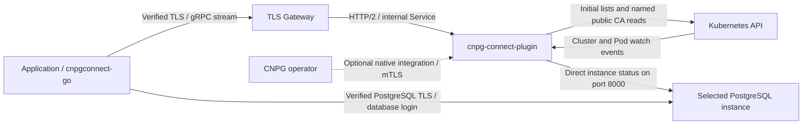

# cnpg-connect-plugin

PostgreSQL topology discovery for **CloudNativePG 1.30.0**, with a **gRPC streaming API** and the companion [cnpgconnect-go](https://github.com/nakiner/cnpgconnect-go) library.

An application supplies three things:

1. The discovery address.
2. The database's Kubernetes namespace and CNPG Cluster name.
3. Its PostgreSQL username and password.

The plugin discovers the database name, PostgreSQL certificate authority, instance addresses, and current roles. The Go library establishes verified connections, follows topology changes, and reconnects automatically. No connection URL, Kubernetes credentials, discovery token, or PostgreSQL CA file is required in the normal application setup. Database credentials go directly to PostgreSQL; the discovery service never receives them.

```go
import connectpool "github.com/nakiner/cnpgconnect-go/pgxpool"

pool, err := connectpool.Open(ctx, connectpool.Config{
    Address:   "topology.example.com:443",
    Namespace: "databases",
    Cluster:   "app-db",
    Username:  "app",
    Password:  password,
})
if err != nil {
    return err
}
defer pool.Close()
```

Primary connections are the default. The library also supports standby policies, native pgx, `database/sql`, and Bun. See [Connect applications](#connect-applications).

**Release status:** the watch-driven observer described here requires a new plugin image and chart release. Until those artifacts are published, build this checkout with the [local image and chart instructions](#run-this-checkout). The application protobuf API is unchanged. The OCI commands below use `CNPG_CONNECT_VERSION`, set to the published version you intend to install, without a leading `v`.

## Install in Kubernetes

The operator installs discovery once. Applications then use the three settings above. You need CNPG 1.30.0, Helm with OCI support, cert-manager, and an HTTP/2-capable Gateway with a publicly trusted certificate for the discovery hostname. Existing TLS Secrets can replace cert-manager; see [certificate options](docs/deployment.md#certificates).

The example uses release `connect` in the operator namespace `cnpg-system`, watching an existing database namespace `databases`. Keep one release per CNPG operator installation; use `replicaCount` for additional replicas.

### 1. Install the plugin

Save this as `values.yaml`, or use [examples/values-gateway.yaml](examples/values-gateway.yaml):

```yaml
fullnameOverride: cnpg-connect
watchNamespace: databases
tls:
  application:
    enabled: false # TLS terminates at the Gateway below.
```

Install the published OCI chart:

```sh
helm upgrade --install connect oci://ghcr.io/nakiner/charts/cnpg-connect-plugin \
  --version "${CNPG_CONNECT_VERSION:?Set the published release version}" \
  --namespace cnpg-system \
  -f values.yaml \
  --wait --timeout 5m
```

The chart selects the matching `ghcr.io/nakiner/cnpg-connect-plugin` image, supporting `linux/amd64` and `linux/arm64`. No `helm repo add`, separate backend, sidecar, or custom database CRD is needed. Public GHCR packages need no registry login. See [registry access and releases](docs/releasing.md) if your packages are private.

The chart still manages the separate CNPG-I certificates. `tls.application.enabled: false` changes only the application listener: it speaks HTTP/2 without TLS to the Gateway, and its Service advertises `appProtocol: kubernetes.io/h2c`. Keep that backend Service internal.

### 2. Publish one discovery address

Route your discovery hostname through an existing TLS Gateway using [Gateway API GRPCRoute](https://gateway-api.sigs.k8s.io/reference/api-types/grpcroute/). For example, save and apply this `GRPCRoute`, replacing the hostname and Gateway reference with yours:

```yaml
apiVersion: gateway.networking.k8s.io/v1
kind: GRPCRoute
metadata:
  name: cnpg-connect
  namespace: cnpg-system
spec:
  parentRefs:
    - name: gateway-external
      namespace: networking
      sectionName: https
  hostnames:
    - topology.example.com
  rules:
    - backendRefs:
        - name: cnpg-connect-api
          port: 443
```

The Gateway listener must admit routes from `cnpg-system`, support gRPC/h2c upstreams, and present a certificate for `topology.example.com` trusted by application system roots. Point that DNS name at the Gateway. The Service's `443` port forwards cleartext HTTP/2 to the plugin's `8080` backend in this setup; TLS ends at the Gateway.

This single platform configuration provides a verified TLS endpoint to every application. No per-application certificate mounts or discovery tokens are needed. A direct TLS LoadBalancer and private CA deployments are also supported; see [deployment options](docs/deployment.md#discovery-endpoint-options).

### 3. Connect the application

Use the `pgxpool.Open` example at the top of this page with the discovery hostname, namespace/Cluster, and PostgreSQL login. Existing Clusters in the plugin's watch scope are discovered automatically; no annotation or native `spec.plugins` entry is needed.

The plugin reads the database name from CNPG bootstrap configuration and the public PostgreSQL CA from the Cluster's server CA Secret. It does not read database passwords. The default is the bootstrap application database. For a Cluster hosting several application databases, use the client's advanced explicit connection configuration to select another database.

Automatic observation stays outside CNPG's reconciliation path, so discovery outages do not add a dependency to CNPG failover. Explicit opt-out, optional endpoint parameters, and native CNPG-I enrollment are covered in [observation modes](docs/deployment.md#observation-modes-and-cnpg-availability).

The library tries an instance's internal address first, then its advertised external address when needed. Applications do not need a network setting. The operator provides reachable per-instance external endpoints when applications cannot reach the Pod network; see [external PostgreSQL endpoints](docs/deployment.md#external-clients-and-database-addresses).

## Verify discovery

From this source checkout, query your published address using `grpcurl`:

```sh
grpcurl \
  -import-path proto -proto cnpg/connect/v1/topology.proto \
  -d '{"namespace":"databases","name":"app-db"}' \
  topology.example.com:443 cnpg.connect.v1.TopologyService/GetTopology
```

Replace `GetTopology` with `WatchTopology` to watch the stream. The API does not require a database login or a discovery token by default. Reflection is not enabled, so supply the proto from the installed plugin release.

A healthy response has `available: true`, a future `validUntil`, a `primaryId`, eligible `members`, and `connection` metadata containing the default database and public PostgreSQL CA. The CA is encoded as base64 in protobuf JSON. Each streamed message replaces the previous snapshot; refreshes can keep the same revision while extending its validity.

Instance observation starts when a client requests that Cluster. An initial response can therefore be unavailable with `awaiting_observation`; `WatchTopology` receives the completed observation automatically. A unary `GetTopology` schedules collection and returns the current snapshot, so repeat it after collection completes when diagnosing an idle Cluster.

The library handles stream renewal and reconnection. `grpcurl` is a diagnostic client and must be restarted when its stream ends. See the [API contract](docs/api.md) for role, freshness, and failure semantics.

## Connect applications

Use [cnpgconnect-go](https://github.com/nakiner/cnpgconnect-go) and its matching release. The simple `pgxpool.Open` call above discovers connection defaults and owns its discovery client. Keep the returned pool for the application's lifetime and close it during shutdown.

The same model is available through `github.com/nakiner/cnpgconnect-go/stdlib` for `*sql.DB`. Bun wraps that SQL handle. Applications do not need their own watchers, role-change callbacks, connection URLs, or reconnect loops.

The plugin reports transitions in every direction: synchronous → asynchronous, synchronous → primary, primary → standby, and subsequent changes. CNPG performs promotion, fencing, and replication configuration. “Read-only discovery” describes the plugin's access, not a restriction to standby databases.

Connections acquired after a topology change follow the current policy. Existing transactions can still fail during a switchover or failover; the library does not replay writes or transactions. Synchronous/quorum replication also does not guarantee that every replica has replayed a specific commit. See the library's usage documentation for additional routing policies and advanced overrides.

The library imports the canonical protobuf messages and generated streaming client from `github.com/nakiner/cnpg-connect-plugin/api/connect/v1`. Importing that package does not compile the plugin's observer or Kubernetes packages into the application.

## Architecture



| Listener | Service | Purpose |
| --- | --- | --- |
| CNPG-I `:9090` | `cnpg-connect:9090` | Operator integration with mutual TLS |
| Discovery `:8080` | `cnpg-connect-api:443` | Application gRPC API; TLS or internal h2c behind a TLS Gateway |
| Health `:8081` | No Service | Kubernetes HTTP liveness/readiness probes |

Shared Kubernetes watches maintain Cluster and CNPG Pod metadata in memory. A change queues only the affected Cluster; there is no periodic global rescan or fixed 100 ms event delay. Instance status collection runs only for Clusters with discovery consumers, and one collection serves all subscribers to that Cluster.

Primary/routing changes cancel obsolete in-flight collections. A share of the worker and probe limits is reserved for urgent events, so unrelated slow background checks cannot occupy all capacity. With the defaults, four of the 32 workers and 16 of the 128 probe slots are reserved; the limits include these reservations. Replica verification and conflicting-primary checks still run before a usable topology is published.

CNPG 1.30 does not publish actual synchronous/asynchronous replication state through a stream. The plugin therefore checks `/pg/status` directly on active Clusters' instances, immediately after relevant events and periodically for changes that have no Kubernetes event. These bounded checks use the existing PostgreSQL CA for HTTPS, bypass the Kubernetes API proxy, and need no database password or client certificate. The client-facing API remains a gRPC stream. See [event delivery and scaling](docs/deployment.md#event-delivery-and-scaling).

The application API is read-only and tokenless by default: anyone who can reach it can discover observed Clusters in the configured watch scope. Only public connection metadata is returned, never PostgreSQL passwords or private keys. An optional bearer token is available for deployments that want it; see [optional discovery authentication](docs/deployment.md#optional-discovery-authentication).

## Configuration reference

See [chart/values.yaml](chart/values.yaml) for all values and [runtime flags](docs/deployment.md#runtime-flags) for process options.

| Helm value | Default | Purpose |
| --- | --- | --- |
| `fullnameOverride` | Empty | Use `cnpg-connect` for the resource names in this guide |
| `watchNamespace` | Empty | One namespace, or all namespaces when empty |
| `replicaCount` | `1` | Independent observer replicas |
| `image.repository`, `image.tag` | GHCR image, matching chart release | Override when testing a local/custom build |
| `application.service.type`, `.port` | `ClusterIP`, `443` | Discovery Service |
| `tls.application.enabled` | `true` | Disable for an internal h2c backend behind a TLS Gateway |
| `tls.application.existingSecret` | Empty | Existing discovery server certificate when plugin TLS is enabled |
| `application.auth.existingSecret`, `.key` | Empty, `token` | Optional bearer authentication; empty means no token required |
| `tls.certManager.enabled`, `.createIssuer` | `true`, `true` | Generate CNPG-I and, when enabled, discovery certificates |
| `observer.pollInterval`, `.ttl`, `.probeTimeout` | `5s`, `15s`, `2s` | Active Cluster status refresh, snapshot expiry/unary demand lease, and direct instance request timeout |
| `observer.maxConcurrency` | `128` | Maximum parallel instance probes across active Clusters |
| `observer.maxConcurrentClusters` | `32` | Whole-Cluster collections running at once; independent of the instance probe cap |
| `observer.kubeAPIQPS`, `.kubeAPIBurst` | `20`, `40` | Kubernetes metadata/CA request limits; direct instance checks do not use this limiter |
| `resources.requests` | `250m`, `256Mi` | CPU and memory reserved for scheduling |
| `resources.limits` | `2` CPUs, `1Gi` | Container limits; Go automatically adapts CPU parallelism to the CPU limit |
| `serviceAccount.create`, `rbac.create` | `true`, `true` | Chart-managed identity and permissions |

The observer has read access to Clusters, Pods, and Secrets in its watch scope. Secret access is `get` only and fetches the named PostgreSQL server CA; the API publishes certificate blocks only. No Pod proxy permission is needed. Network policies must allow plugin Pods to reach database Pod IPs on TCP 8000. Set `watchNamespace` to keep metadata and Secret access local to your database namespace when practical. The TTL must exceed the status refresh interval plus probe timeout; the client expires stale snapshots automatically.

Cluster parameters are optional: `serverName` overrides the default PostgreSQL TLS identity `<cluster>-rw.<namespace>.svc`; `externalEndpoints` provides per-instance external addresses. Set parameters with the optional `connect.cnpg.io/parameters` annotation, or in a native plugin entry when using that integration.

## Operations

Inspect the plugin with:

```sh
kubectl -n cnpg-system logs deployment/cnpg-connect --tail=100
kubectl -n cnpg-system get pods,services -l app.kubernetes.io/instance=connect
kubectl -n cnpg-system rollout status deployment/cnpg-connect --timeout=180s
```

`/healthz` checks process liveness; `/readyz` reports observer initialization. Querying topology confirms that a particular database currently has a usable routing view.

An info-level `topology changed` log reports the Cluster, primary, member roles and sync states, availability/reason, and observation duration when routing changes. Routine freshness renewals do not produce a promotion log. The new observer's production switchover latency has not yet been measured; earlier timing measurements apply to the previous implementation.

Upgrade using the same OCI command and values file with a new published `CNPG_CONNECT_VERSION`. Helm uses the matching image by default. Keep certificate, Gateway, and endpoint settings in your deployment configuration. Use `helm history connect -n cnpg-system` and `helm rollback connect REVISION -n cnpg-system --wait` to return to a previous Helm revision; rollback does not restore external Secrets or database state.

Existing installations that set `application.auth.existingSecret` retain bearer authentication until that value is cleared. To move to the simple setup, remove that setting, configure the TLS Gateway, and use a plugin/client release containing connection metadata. PostgreSQL login credentials remain unchanged.

Additional replicas keep independent watches and observe the Clusters requested by their own clients. Work is shared between subscribers within a replica, but not across replicas. Streams reconnect to any healthy replica and receive a complete snapshot. The chart does not create a PodDisruptionBudget, HPA, or NetworkPolicy. See [deployment and operations](docs/deployment.md) for certificate rotation, private endpoint configurations, network behavior, and RBAC details.

For thousands of databases, budget status traffic by active instance count, not service count: approximately `active instances / refresh interval` requests per second per plugin replica. See [capacity planning](docs/deployment.md#capacity-planning) for concurrency, startup CA reads, memory, and the limits of the synthetic scale test. A [large-installation values example](examples/values-large.yaml) provides API startup and resource budgets without changing application configuration.

`observer.pollInterval: 100ms` is supported, but it is a delay between collections, not a fleet-wide freshness guarantee. At 6,000 active three-instance Clusters, refreshing every instance ten times a second would require about 180,000 status requests/second. Primary-change events use the priority queue immediately. Go 1.26 reads the container CPU limit automatically; leave `GOMAXPROCS` unset. The [capacity guide](docs/deployment.md#capacity-planning) explains the measured difference between event latency and periodic refresh latency.

## Troubleshooting

| Symptom | What to check |
| --- | --- |
| OCI `not found` / `unauthorized` | Selected release published successfully; chart package visibility or Helm registry login |
| `ImagePullBackOff` | Image package access, image tag, and node architecture; chart and image are separate GHCR packages |
| Certificate/Issuer kinds missing | Install cert-manager or supply existing CNPG-I TLS Secrets |
| `GRPCRoute` not accepted | Gateway listener name, allowed namespaces, hostname/certificate, and h2c upstream support |
| TLS unknown-authority / hostname error | Discovery endpoint's publicly trusted certificate and DNS name; private CA deployments need explicit client trust |
| gRPC `Unauthenticated` | An optional bearer Secret is still configured; clear it for the default tokenless setup or provide its token |
| `NotFound` | Namespace/name, watch scope, and explicit observation disablement |
| `connection_defaults_unavailable` | CNPG server CA Secret exists, contains valid public `ca.crt`, and is readable by the plugin |
| Database name cannot be discovered | Configure CNPG's bootstrap application database or use the client's advanced `ConnConfig` |
| `awaiting_observation` | First demand for an idle Cluster; keep `WatchTopology` open for the completed observation |
| Snapshot unavailable or expired | Primary transition, Pod readiness/fencing, metadata watch health, or direct Pod IP:8000 access/TLS |
| Discovery works but SQL does not | Database credentials and reachability of the advertised member addresses; external clients need external mappings |
| Streams disconnect periodically | Normal connection renewal or Gateway/LB idle timeout; the library reconnects |

## Run this checkout

Building requires Go **1.26.4+**. Run the local checks with:

```sh
make build
make check
make race
```

To deploy the current source before publishing a release, build and push your own image, then install the local chart. Replace the registry with one your Kubernetes nodes can pull from:

```sh
make image IMAGE=registry.example.com/cnpg-connect-plugin:dev
docker push registry.example.com/cnpg-connect-plugin:dev
helm upgrade --install connect ./chart \
  --namespace cnpg-system \
  -f examples/values-gateway.yaml \
  --set image.repository=registry.example.com/cnpg-connect-plugin \
  --set-string image.tag=dev \
  --wait --timeout 5m
```

The build architecture must match the nodes. For a multi-platform image, use `docker buildx build --platform linux/amd64,linux/arm64 --tag IMAGE --push .`. Configure the Gateway as above; Clusters are discovered automatically. The observer changes preserve the protobuf API used by existing compatible client releases.

For a local observer, use an explicit kubeconfig:

```sh
./bin/cnpg-connect-plugin \
  --kubeconfig=/path/to/kubeconfig --namespace=databases \
  --insecure \
  --plugin-address=127.0.0.1:9090 \
  --discovery-address=127.0.0.1:8080 \
  --health-address=127.0.0.1:8081
```

`--insecure` disables both listeners' TLS for local development; the Helm chart never enables it. Use `grpcurl -plaintext` for this local endpoint. `--discovery-plaintext`, used by the Gateway chart values, disables only application-listener TLS and preserves CNPG-I mutual TLS.

The observer process must be able to route to database Pod IPs on TCP 8000. A laptop kubeconfig alone does not provide that route; run the observer in Kubernetes or connect the local process to the Pod network.

`make generate` regenerates the protocol bindings with pinned Go generators under `work/bin`. The [release workflow](https://github.com/nakiner/cnpg-connect-plugin/actions/workflows/release.yaml) publishes versioned GHCR images and OCI charts. See [release instructions](docs/releasing.md), the [validation record](docs/validation.md), and [opt-in integration tests](test/e2e/README.md).

## Uninstall

If you configured native `connect.cnpg.io` entries, remove them from Clusters before removing the plugin; preserve other plugins. The default automatic observation has no native reconciliation dependency. Move applications off this discovery endpoint, remove its `GRPCRoute`, then run:

```sh
helm uninstall connect --namespace cnpg-system --wait --timeout 5m
```

Keep the CNPG operator running while its plugin Service finalizer completes. The database and CNPG operator remain installed. Externally managed TLS/token Secrets and Gateway certificates are not owned by this release.

## License

A license has not been selected. The plugin reports `UNLICENSED` in CNPG-I metadata; no open-source license grant is included.
