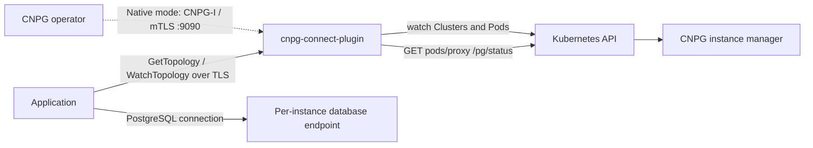

# cnpg-connect-plugin

CloudNativePG topology discovery for applications that need to distinguish primary, synchronous, quorum, potential synchronous, and asynchronous PostgreSQL instances.

The plugin runs as one Deployment alongside the CNPG operator. It exposes the CNPG-I protocol to the operator and a separate TLS gRPC API to applications. A background observer reads Kubernetes state and each instance's `/pg/status` through the Kubernetes API server. Applications can get a complete topology snapshot or watch a stream of snapshots; they do not need Kubernetes credentials.

This is an initial implementation targeting **CloudNativePG 1.30.0**, **CNPG-I 0.5.0**, and **Go 1.26.4+**. Local integration tests passed against a real three-instance CNPG cluster, including streamed switchover, standby replacement, and automatic failover while discovery was stopped in annotation mode. See the [validation record](docs/validation.md) for tested versions and remaining deployment acceptance work. The Go connection/pool library is the next step and is not part of this repository.



CNPG retains responsibility for election, fencing, promotion, and replication configuration. The plugin does not modify Clusters, promote PostgreSQL instances, proxy SQL, or replay failed transactions. A snapshot is an observation, not a lease guaranteeing a server's role when the next SQL statement arrives.

**Choose annotation-based observation to keep discovery availability out of CNPG's failover control path.** In CNPG 1.30.0, native `spec.plugins` registration introduces a reconciliation dependency: plugin loading or Pre-hook failures can abort reconciliation before failover processing. Annotation-based observation uses the same Deployment and gRPC API without registering this plugin on that Cluster. See [mode selection and upstream evidence](docs/deployment.md#observation-modes-and-cnpg-availability).

## Run in Kubernetes

Prerequisites:

- CNPG 1.30.0 installed, with the operator's namespace known.
- cert-manager installed, or three pre-created TLS Secrets as described below.
- An image built from this checkout and available to the cluster.
- A namespace for the PostgreSQL Cluster; create it before installing with `watchNamespace` set.

Build and push using your registry, then create the application discovery token in the operator namespace. The token must contain at least 32 non-whitespace characters. Keep its value in your secret-management system.

```sh
make image IMAGE=registry.example.com/cnpg-connect-plugin:0.1.0-dev
# Push the image using your registry workflow.

mkdir -p work
(umask 077; openssl rand -hex 32 > work/discovery-token)
kubectl -n cnpg-system create secret generic cnpg-connect-auth \
  --from-file=token=work/discovery-token

helm upgrade --install connect ./chart \
  --namespace cnpg-system \
  --set fullnameOverride=cnpg-connect \
  --set image.repository=registry.example.com/cnpg-connect-plugin \
  --set image.tag=0.1.0-dev \
  --set watchNamespace=databases
```

Install the plugin **in the operator namespace** so native CNPG-I registration can discover its Service and read the annotated TLS Secrets. Each Cluster must opt in through one of two modes. The recommended annotation mode is:

```yaml
metadata:
  annotations:
    connect.cnpg.io/enabled: "true"
    connect.cnpg.io/parameters: '{"serverName":"app-db-rw.databases.svc"}'
```

The parameters annotation is optional. Leave `connect.cnpg.io` out of `spec.plugins` when using this mode; other plugins may remain. See the full [annotation Cluster example](examples/cluster-annotation.yaml).

For native CNPG-I lifecycle integration, register the plugin instead and accept the availability dependency described above:

```yaml
spec:
  plugins:
    - name: connect.cnpg.io
      enabled: true
```

A native entry takes precedence over annotations, including `enabled: false`, which disables observation. Merge native entries with existing plugins. The [native Cluster example](examples/cluster.yaml) adds optional per-instance external PostgreSQL endpoints and an internal TLS server-name override. Both modes use the same process and API; no extra backend or CRD is installed.

The default chart creates a private CA, an operator-client certificate, a CNPG-I server certificate, and an application server certificate through cert-manager. The application discovery Service is `cnpg-connect-api:443`; the CNPG-I Service is `cnpg-connect:9090`. They route to separate ports in the same process.

See [deployment and TLS](docs/deployment.md) for existing Secrets, external LB access, RBAC, rotation, and runtime flags.

## Discovery API

The protobuf contract is [proto/cnpg/connect/v1/topology.proto](proto/cnpg/connect/v1/topology.proto); generated Go bindings are in [api/connect/v1](api/connect/v1).

| RPC | Result |
| --- | --- |
| `cnpg.connect.v1.TopologyService/GetTopology` | Current full `Snapshot` for a namespace and Cluster name |
| `cnpg.connect.v1.TopologyService/WatchTopology` | Current full snapshot followed by observations and invalidations |

Every RPC requires TLS and `authorization: Bearer <token>` metadata. A bearer token grants access to **all observed Clusters** served by that deployment; per-application or per-Cluster authorization is not implemented.

Snapshots separate `role` from `sync_state`, carry stable instance identity as Pod UID, expose internal and optional external endpoint maps, and include an opaque `revision`, `observed_at`, and `valid_until`. Clients must check freshness and eligibility even when the endpoint address has not changed. A refresh may retain its revision while extending its validity; do not discard those refreshes.

A `sync` or `quorum` designation describes PostgreSQL replication participation. It does not guarantee read-after-write visibility on an arbitrary replica. Routing and retry semantics belong in the future client library. See [API semantics](docs/api.md).

## Local development

```sh
make build
make test
make race
make vet
make chart-check
```

The observer needs a kubeconfig authorized to read Clusters and Pods and use `get pods/proxy`. For a loopback-only development session, use annotation-based opt-in on the Cluster so CNPG does not depend on reaching the local plugin:

```sh
./bin/cnpg-connect-plugin \
  --kubeconfig=/path/to/kubeconfig \
  --namespace=databases \
  --insecure \
  --plugin-address=127.0.0.1:9090 \
  --discovery-address=127.0.0.1:8080 \
  --health-address=127.0.0.1:8081

grpcurl -plaintext \
  -import-path proto -proto cnpg/connect/v1/topology.proto \
  -d '{"namespace":"databases","name":"app-db"}' \
  127.0.0.1:8080 cnpg.connect.v1.TopologyService/GetTopology
```

`--insecure` disables TLS and authentication and rejects TLS/token flags. Unspecified listener addresses bind to loopback in this mode. The chart never enables it. For deployed testing, use the TLS invocation in [API semantics](docs/api.md).

After editing the protobuf contract, install Buf v1.25 or newer and run `make generate`. The target installs pinned Go code generators under `work/bin`; generated bindings are committed. CI builds the binary and image, runs Go checks and race tests, and renders chart configurations. It does not publish artifacts or deploy.

## License

A license has not been selected. The plugin reports `UNLICENSED` in CNPG-I metadata. No open-source license grant is included in this initial implementation.
